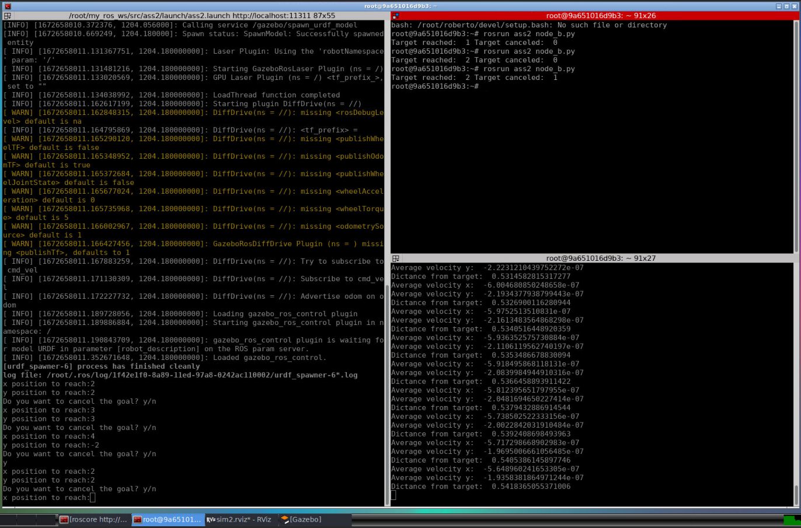

Assignment 2 of Research Track I
================================

This assignment required to create a package where implement three different nodes. 
- A node that implements an action client, allowing the user to set a target (x, y) or to cancel it and also publishes the robot position and velocity as a custom message (x,y, vel_x, vel_z);
-  A service node that, when called, prints the number of goals reached and cancelled;
-  A node that subscribes to the robot’s position and velocity and prints the distance of the robot from the target and the robot’s average speed.

It is needed to implement a launch file in order to run the environment of the simulation and set parameter.

How to download
----------------------

In order to run the solution it is necessary to download two different packages into the src folder of the ros workspace:
- https://github.com/CarmineD8/assignment_2_2022 which set the environment;
- https://github.com/giuliab00/RTI_Assignment2 and save it in a folder named "ass2"

How to run the solution
----------------------

First of all is necessary:

```bash
roscore
```

Then to run the environment and node A:

```bash
roslaunch ass2 ass2.launch
```

After this command is given it is possible to give directly the coordinates to reach.

In a new terminal is possible to see the number of target reached and canceled by launching this command:

```bash
rosrun ass2 node_b.py 
```

While to obtain the distance from the target and the average speed at rate of 1 second it is necessary to launch the following command in a new terminal:

```bash
rosrun ass2 node_c.py 
```

Having the simulation and three nodes running looks like this:



Additional requirements
----------------------
## NODE A
It is now analyzed the functioning of the Node A by pseudocode, which is also relevant for the other two nodes since their implementation depends on this one.

# Pseudocode
```python
Initialize constructors

def coordinate():

	while True:
		take x as keyboard input 
		take y as keyboard input

	return(x,y)


def clbk_odom(msg):
	
	Taking value needed to publish from Pose 
	Initialize Info object
	Passing values to Info	

	if not shutdown:
	        Publish Info
  
def tgt(x,y):
			  	
	Initialize Point object
	Passing values to Target	
	Publish target

def get_info_goal(req):

	return counters value to target service
  
def main():
	
	Initialize Pose object
	Initialize counter for reached and cancelled target
	Initialize Node A
	Create a new client
	Publish Node A
	Publish Node C
	Make sub to odom
	Service definition
	Wait for the server ready
	
	while True:
		
		Set the goal coordinate to reach from input console	
		Publishing target coordinate	
		Passing the input value to Pose object
		Create object Planning goal 
		Assign the goal		
		Send goal to the server
			
		while True:
			
			Taking keyboard input 

			if input is given:
				    
				if input = yes:
					Cancel goal
					Take time to process
					Check the state

					if state preempted:
						update counter canceled goal
					break
			else:
				Check the state
				if state == reached goal:
					update counter reached goal
					break

		Wait for the result
```
